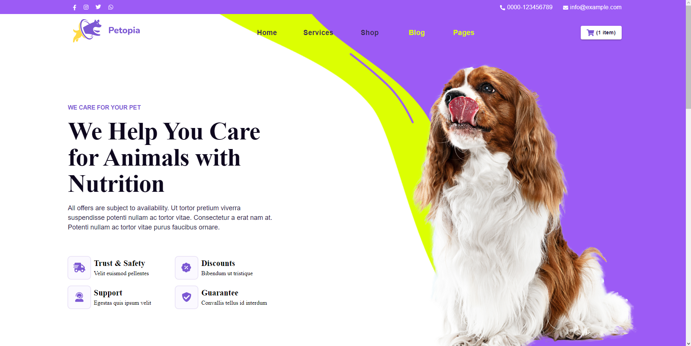

# Petopia
This project is a React application that represents the home of an e-commerce website and includes product CRUD operations from the dashboard. The application is built using React, React-Query, Material UI, and Typescript. The product CRUD operations include creating, deleting, and updating products, as well as updating product categories, creating variants, deleting variants, changing attributes, uploading images, and getting attributes and categories.

# Preview

# Installation Instructions
To install the application, follow these steps:
1. Clone the repository to your local machine.
2. Install the required dependencies by running `npm install`.
3. Start the application by running `npm start`.

# Usage Instructions
To use the application, follow these instructions:
1. Navigate to the home page at `http://localhost:3000/`.
2. Use the navigation menu to access the product CRUD operations at `http://localhost:3000/products`.
3. Follow the instructions on the page to perform the product CRUD operations.

# API Endpoints
The following API endpoints are used in the application:
- `/api/products` - CRUD operations for products
- `/api/categories` - CRUD operations for categories
- `/api/variants` - CRUD operations for variants
- `/api/attributes` - CRUD operations for attributes

# Product CRUD Operations
To perform the product CRUD operations, follow these instructions:
- Create product: Click the "Create Product" button and fill in the required information.
- Delete product: Click the "Delete" button next to the product you want to delete.
- Update translate: Click the "Edit" button next to the product you want to update and enter the new translation.
- Update product category: Click the "Edit" button next to the product you want to update and select the new category.
- Create variant: Click the "Create Variant" button and fill in the required information.
- Delete variant: Click the "Delete" button next to the variant you want to delete.
- Change attributes + delete attributes (in the same request): Click the "Edit" button next to the product you want to update and select the new attributes.
- Upload images + remove images (in the same request): Click the "Edit" button next to the product you want to update and select the new images.
- Get attributes: Click the "Attributes" button to view the attributes.
- Get categories: Click the "Categories" button to view the categories.

# Technologies Used
The application was built using the following technologies:
- React
- React-Query
- Material UI
- Typescript
- React-Router-Dom

 

# Conclusion
Thank you for using our e-commerce website application. We invite your feedback and suggestions for further improvements.